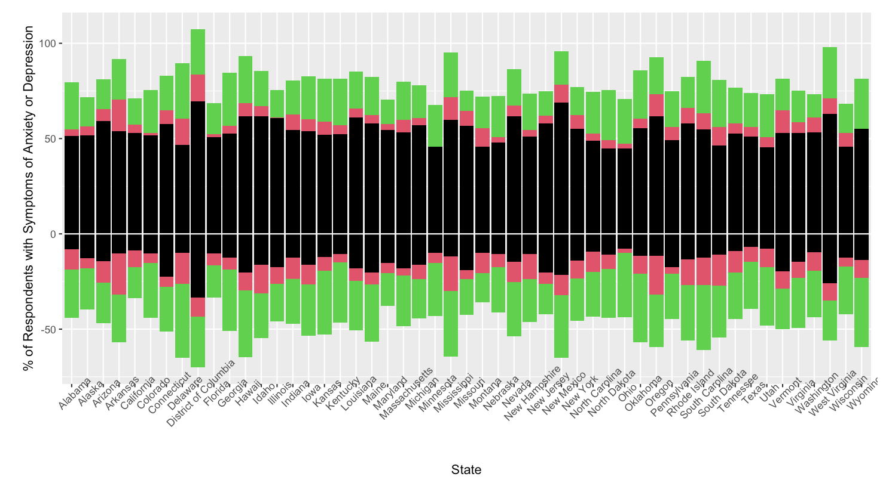

## Takeaways
From our data, we can clearly see the increase of the amount of adults who reported symptoms of anxiety or depression in every State during the Coronavirus pandemic. Using phase 1 as our starting point, we can see as the three phases pass, more and more adults report that they are experiencing some kind of symptoms of anxiety or depression. This makes sense to us due to how disturbed daily life was in isolation, and as a group, have also discussed how we have felt some of these symptoms during some period of the pandemic.

## Our Data Quality
Since our data is being taken from the CDC website, it gives unbiased results. The data is strictly reporting how many adults in the United States have experienced any Anxiety or Depression symptoms. We do not see any issues within the data that could potentially harm certain groups of people.

## Limitations
While efforts are working towards more COVID-19 questions in these surveys conducted by the US Census Bureau, surveys themselves require a lot of time and many interviews to acquire sufficient data to disclose. _The Household Pulse Survey_ is one designed to enter the society quickly in search of answers near real-time, providing data scientists and users the information they can use in order to ease the burden of the pandemic.

We must note the importance of potential sampling error. Surveys tend to hold nonsampling errors including:

- Measurement error: The respondent provides incorrect information or unclear survey question is misunderstood by respondent.
- Coverage error: People who otherwise would have been included in the survey frame were missed. 
- Non-response error: Responses are not collected from all those in the sample or the respondent is unwilling to provide information.
- Processing error: Forms may be lost, data may be incorrectly keyed, coded, or recoded.

## Future Ideas
With this project, we wanted to target health care professional and people who have experienced any type of symptoms during this pandemic. We want to make it clear that there is an increase of these symptoms throughout the United States and if you are feeling any of these symptoms, you are not alone. Mental health seems to be pushed aside during these times where our world has been turned upside down but we are still required to try to continue our lives like nothing has happened. 
