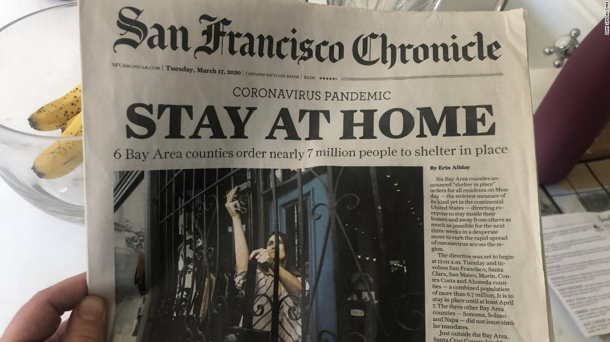

## Project Overview
This report provides a broad overview for the percentage of adults experiencing _symptoms of anxiety and depression_ throughout the _phases of the coronavirus pandemic_. No matter the user, this report is to emphasize the mental health affects of covid by comparing the contribution of the different phases. Overall the mission is to bring awareness towards not only symptoms relating to anxiety and depression, but to bring awareness to mental health in general.

We have aimed to provide the user easy to understand graphs describing the relationship of coronavirus and symptoms of depression, anxiety or both combined through the _CDC's_ work. Along with this, the user is able to filter through the various phases to recognize the difference/similarity between each.

## What is our data?
Our chosen data set is from the _CDC_ and it contains information about mental health rates among US citizens during the coronavirus pandemic. The _US Census Bureau_ also assisted in the collection and organization of this data. The data was collected via an online survey where questions were asked about the frequency of anxiety and depression symptoms among adult respondents. This data set is available online for public view and was conducted to analyze the prevalence of heightened mental health issues during this trying time.  

The data can be found [here](https://www.cdc.gov/nchs/covid19/pulse/mental-health.htm).

## Who is our audience? 
Our target audience would be people who have struggled with mental health issues throughout the pandemic. Through the data we plan to target those who have suffered from anxiety and depression symptoms during the pandemic. We believe we can provide comfort to those experiencing these types of symptoms. 

  

Created by Madeleine Nowak, Makenzie Edwards, Bella Lee, and Kyle Raychel